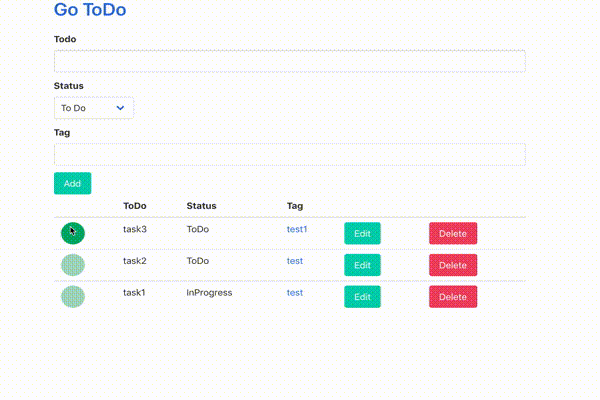

# go-todo

This is a todo list implemented in Go.
It can be managed using tags.


I created this to study Go.





## Usage

You can use this command.
Go to `localhost:8080` in your browser.

```bash
go run main.go
```


Development command

```bash
# You need to set the "$GOPATH/bin" path.
reflex -r '(\.go$|go\.mod)' -s go run main.go
```


## Initialize Data

If you want to initialize the data, type this command.
(You will lose your previous TODO data.)

```bash
rm todo.sqlite3
```


